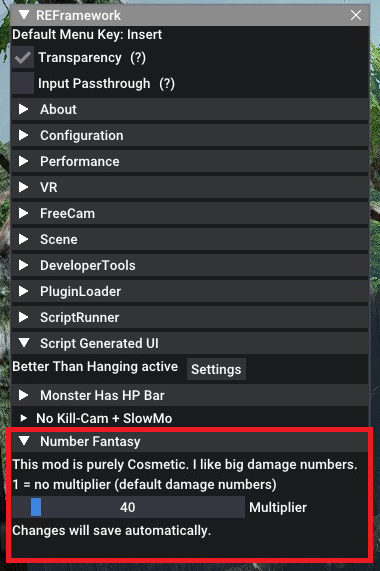

# MHRise Damage Numbers Mod
This is a simple Damage Numbers mod. I hate seeing small 1 to 2 digit damage popups. I've been longing for that Korean MMO experience where the huge damage numbers alone made the combat feel better (IMO). This mod tries to capture that by adding a multiplier to the value of the numbers DISPLAYED. 

## This mod does not effect your actual damage. 

# Installation
- Requires that you have [REFRAMEWORK](https://www.nexusmods.com/monsterhunterrise/mods/26) installed.
- Run the game to allow REFramework to create an 'autorun' folder if it isn't present.
- Download the file, extract the lua script, and drop it into your 'autorun' folder in the game's installation directory.
- Example: `` 'steamfolder'\steamapps\common\MonsterHunterRise\reframework\autorun\number_fantasy.lua``

# Usage
- Use the [REFRAMEWORK](https://www.nexusmods.com/monsterhunterrise/mods/26) menu key to open the REFramework window if it is not open.
- Navigate to the "Script Generated UI" tab and click to open it.
- Open the "Number Fantasy" tab
- Use the Slider to change the multiplier value. It will auto save when a change is made and is persistent between sessions. By default the multiplier starts off at *25 (500 is max)
- Setting the slider to 1 will essentially disable the mod
#### - *NOTE: To add a SPECIFIC value you can press the 'TAB' key while dragging the slider and it will let you type instead*
 

## Changelog:
---
#### v0.2.0
- Fixed: Multiplier slider going below 1, making all dmg 0 at that point.
#### v0.1.0
- Initial Release

# Screenshots

